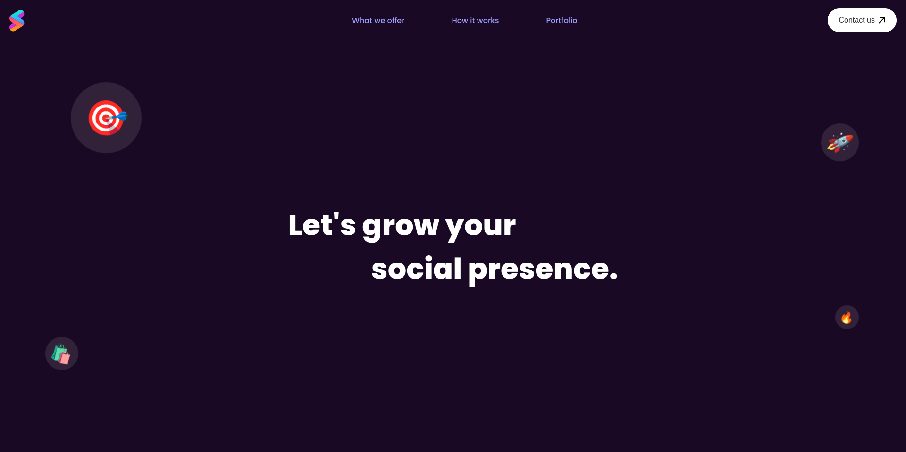

# Animated Form 

## Tela inicial feita com ReactJs e Sass

   

# Funcionalidades

* Tela animada

# Tecnologias Utilizadas

* ReactJS - Para construção da interface

* CSS - Para estilização da interface

# Conceitos Abordados

Estilização

# Como utilizar

1- Clone o projeto
`git@github.com:helen-andrade/animated-form.git`

2- Instale as dependências
`npm i`

3- Rode o script de desenvolvimento
`npm run dev`

---

    
Feito com ♡ por Helen Andrade

